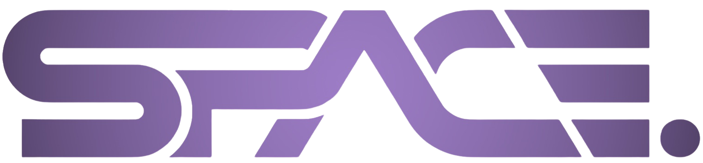

<div align="center">



# SpacePoint Intern Portal

**A frontend mockup of a real engineering-internship operating system — capstone-centric task management, a scoped AI mentor, supervisor-approved personalization, and genuine handoff/decision-making readiness exercises, all in one React application.**


**[Live Demo](https://ktariqq.github.io/spacepoint-intern-portal/) · [Repository](https://github.com/ktariqq/spacepoint-intern-portal)**

━━━━━━━━━━━━━━━━━━━━ ✦ ━━━━━━━━━━━━━━━━━━━━

</div>

<br/>

## 🛰️ Overview

SpacePoint Intern Portal is a frontend-only prototype of a redesigned internship experience for SpacePoint's engineering interns. It replaces a minimal task-only Kanban with a full operating layer: real capstones as the primary deliverable, a personal planner distinct from supervisor-defined requirements, a scoped AI mentor that assists but never approves, and two lightweight "engineering readiness" exercises — recovering a real handoff from an unavailable teammate, and making a defensible judgment call when the supervisor genuinely can't be reached.

This is a mockup, not a connected product. There is no backend, no authentication, and no live AI — every screen runs on realistic local mock data so the full workflow can be demonstrated end to end, with the architecture left ready for a real backend to be attached later without a redesign.

<br/>

<div align="center">━━━━━━━━━━━━━━ ✦ ✧ ✦ ━━━━━━━━━━━━━━</div>

<br/>

## 🛰️ What Makes This Project Interesting

- **Capstone-first, not checklist-first.** The primary unit of work is a capstone with real engineering milestones (requirements → sensor selection → hardware design → firmware → data acquisition → analysis → testing → documentation), not a flat list of disconnected tasks.
- **A real permission boundary between intern and supervisor.** The personal planner lets an intern reorder and annotate their own execution plan, but official deadlines and requirements are read-only from the intern's side — enforced in the UI, not just implied by convention.
- **An AI mentor that is visibly scoped.** Every AI surface in the app is labeled "engineering assistance — not supervisory approval," and the automated task/capstone personalization pipeline is explicitly rule-based matching plus AI wording — never AI selection — with every generated plan requiring supervisor approval before an intern ever sees it.
- **Engineering readiness exercises grounded in real skills.** Work Transfer and Urgent Decision are not staged office drama — they model a real teammate handoff recovered from documentation, and a real judgment call made under a deadline with the supervisor unreachable, each ending in a genuine submission reviewed afterward.
- **Two-role demonstration in one build.** A role switcher (not real auth) toggles between the Intern and Supervisor views so the entire governance model — approvals, plan generation, readiness-exercise triggers, audit trail — can be shown in a single session.
- **Deliberately restrained visual design.** Built against an explicit anti-slop design specification: no gradient decoration, no icon-per-heading, no fake statistics, no card-for-everything layout — hierarchy comes from typography, spacing, and a single accent color used sparingly.

<br/>

<div align="center">━━━━━━━━━━━━━━ ✦ ✧ ✦ ━━━━━━━━━━━━━━</div>

<br/>

## 🛰️ Application Areas

### 🟣 Workspace
Dashboard, Onboarding, Tasks & Planner (drag-and-drop via dnd-kit), Capstones, Daily Log, Drive Workspace — the intern's day-to-day real engineering work.

### 🟣 Grow
Learning (project-linked modules), AI Mentor (scoped chat assistant), Resource Library, Progression (experience → supervisor-approved responsibility, opt-in).

### 🟣 Connect
Questions (context-attached, never disappearing into chat), Calendar, Community, Announcements, Intern Talks, Weekly Mentor Reviews.

### 🟣 Readiness
Work Transfer (a real handoff package recovered from documentation under deadline) and Urgent Decision (a timed judgment call with an escalation option), both ending in supervisor review.

### 🟣 Career
Portfolio — auto-compiled from actually completed capstones, submissions, and supervisor feedback.

### 🟣 Supervisor
Cohort dashboard, Plan Generation (rule-based matching + AI wording, always approval-gated), Starter Project Library, Permissions, Audit Trail.

<br/>

<div align="center">━━━━━━━━━━━━━━ ✦ ✧ ✦ ━━━━━━━━━━━━━━</div>

<br/>

## 🛰️ Tech Stack

| Layer | Tools |
|---|---|
| Framework | React 18, TypeScript, Vite |
| Routing | React Router (HashRouter, for clean GitHub Pages support) |
| Styling | Tailwind CSS, custom design tokens (no component library theme) |
| Drag & drop | dnd-kit |
| Icons | lucide-react |
| State | React Context (role switching, gamification toggle, task state) |
| Hosting | GitHub Pages via GitHub Actions |

<br/>

## 🛰️ Project Structure
```
src/
├── assets/
│ └── spacepoint-logo.png
├── components/
│ ├── layout/ # AppShell, Sidebar, Topbar
│ ├── kanban/ # dnd-kit powered planner board
│ └── ui/ # PageHeader, Pipeline, StatusBadge, ListSection, EmptyState
├── data/
│ └── mockData.ts # all realistic mock data lives here
├── pages/
│ ├── supervisor/ # supervisor-only screens
│ └── simulations/ # Work Transfer, Urgent Decision
├── state/
│ └── AppState.tsx # role, gamification, task state
├── types.ts
├── App.tsx
└── main.tsx
```


<br/>

<div align="center">━━━━━━━━━━━━━━ ✦ ✧ ✦ ━━━━━━━━━━━━━━</div>

<br/>

## 🛰️ Getting Started

### Prerequisites
- Node.js 18+

### 1 — Clone the repository
```bash
git clone https://github.com/ktariqq/spacepoint-intern-portal.git
cd spacepoint-intern-portal
```

### 2 — Install dependencies
```bash
npm install
```

### 3 — Run the app
```bash
npm run dev
```
The app opens at `http://localhost:5173`. Use the role switcher in the top bar to demo both the Intern and Supervisor views.

### 4 — Build for production
```bash
npm run build
```

<br/>

## 🛰️ Deployment

The live version deploys automatically to **GitHub Pages** via the included GitHub Actions workflow on every push to `main`. Before deploying your own fork, set `base` in `vite.config.ts` to match your repository name.

<br/>
<br/>

<div align="center">

━━━━━━━━━━━━━━ ✦ ✧ ✦ ━━━━━━━━━━━━━━

Built by **Kommal Tariq**

Copyright © 2026 SpacePoint. All rights reserved.

</div>
